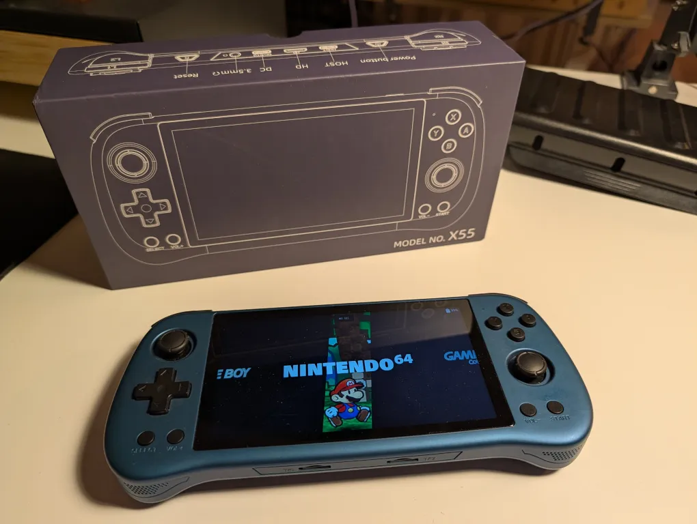

# PowKiddy X55 - Retro Portable Console

> [!IMPORTANT]
> Asking price: **50 EUR**.

> [!NOTE]
> Almost no use.  
> Comes with manufacture SD cards (main and secondary).

> [!TIP]
> Compatible with [ROCKNIX](https://rocknix.org/devices/powkiddy/x55/) os.

Product page: [PowKiddy X55 - Retro Portable Console](https://powkiddy.com/products/powkiddy-x55-5-5-inch-1280-720-ips-screen-rk3566-handheld-game-console-jelos-system-open-source-retro-console-childrens-gifts?srsltid=AfmBOopMi_b3viQRysqx2KMDlTj5bHisbqeRWVajnGnDa3oE6lz7lzYD).

